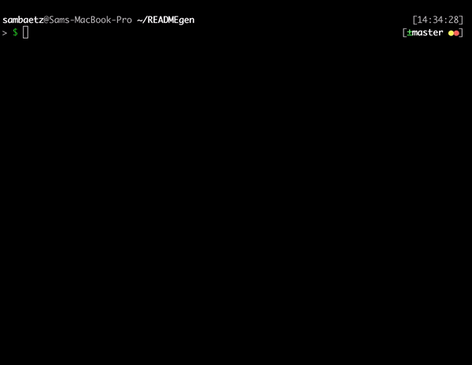
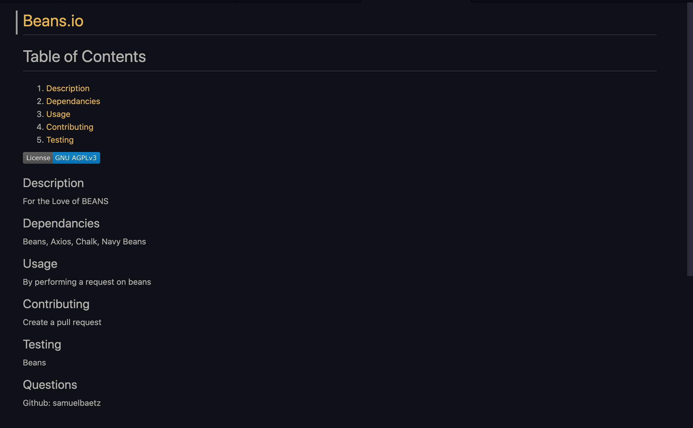

# README Generator

###### Mozilla Public License 2.0

## Description
Using this script you will be able to create a README file for your project.

## Dependancies
Axios, Inquirer, Chalk

## Usage
Run index.js in node and follow the prompts to create a README.

## Contributing 
Clone the project and submit a pull request.

## Testing
Using Jest

